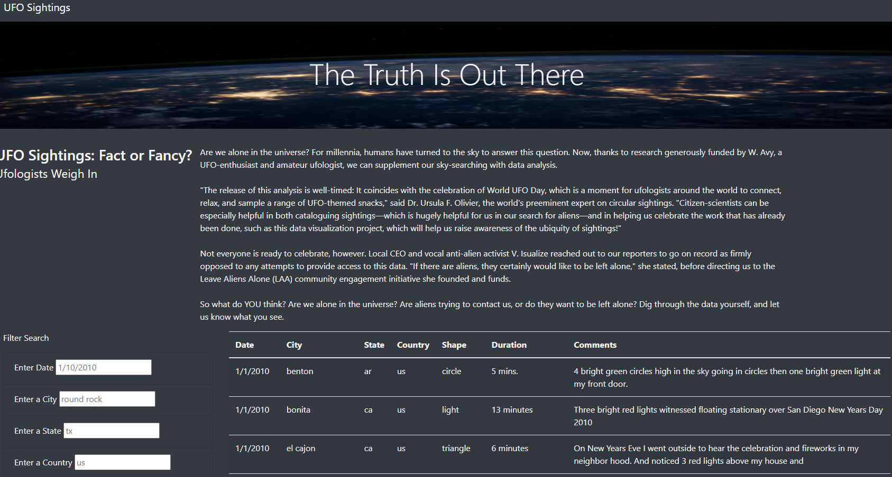
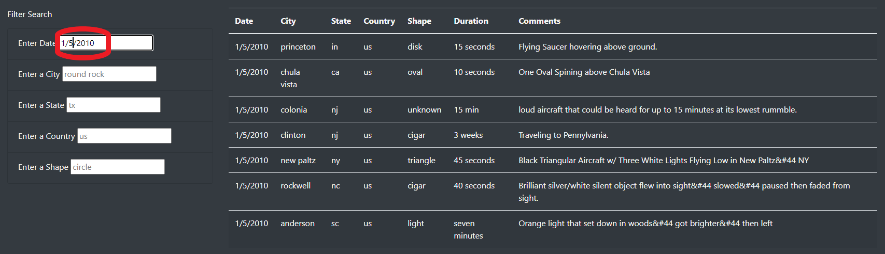
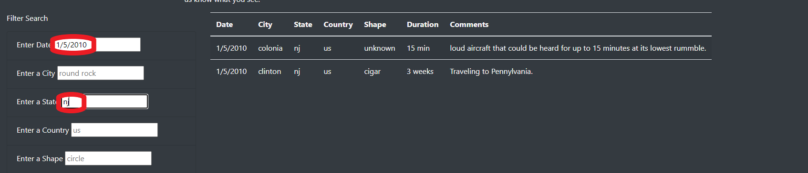

# UFOs

## Overview of Project
The purpose of this project is to create a website that provides a table of UFO sighting data that can be filtered based on user inputs. This is accomplished using HTML with Bootstap for the website design and JavaScript with d3 for performing the filtering actions.

## Results:
When the website [index](index.html) is initially opened it provides a short article about UFOs and a table fully populated with UFO sightings and options for filtering.

There are 5 text boxes on the left hand side that allow filtering. Once text is entered into the box, and the user either hits enter or clicks outside the box, the table is filtered by that data. Here it is shown filtered by date.

If a user enters data into multiple fields, it will filter by all of those fields. Here it is filtered by date and state.

Deleting the text in all the filters will clear the filters and show the full table.

## Summary:
* One drawback of this design is that filtering the data is case sensitive, so the user must match the case and/or formatting that is used in the table exactly.

* Two recommendation for further development:
    1. Add a "Clear Filters" button. This will allow users to quickly clear all filters without having to manually delete each filter separately.
    2. Creating a drop down list instead of a text box for some of the parameters. This would allow users to see the filter options instead of having to guess what values might be in the table.
